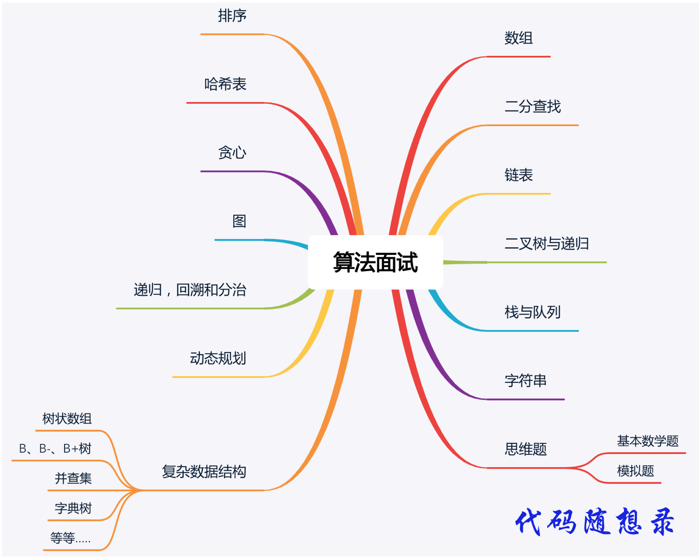

# 算法游戏

## 每日算法学习
- Leetcode Bookbook: https://leetcode.cn/leetbook/detail/leetcode-cookbook/
- 代码随想录: https://programmercarl.com/
- 代码随想录 Bilibili: https://space.bilibili.com/525438321
- 卡码笔记: https://notes.kamacoder.com/question-set/0

| 算法 | 对应题目                                                                | 题解                            |
|--|---------------------------------------------------------------------|-------------------------------|
| 数组 | [题目列表](https://leetcode.cn/leetbook/read/leetcode-cookbook/5licpe/) | [题解](array/README.md)         |
| 链表 | [题目列表](https://leetcode.cn/leetbook/read/leetcode-cookbook/56gbm6/) | [题解](list/README.md)          |
| 哈希表 | [题目列表](https://leetcode.cn/leetbook/read/leetcode-cookbook/5l5dce/) | [题解](hash/README.md)          |
| 字符串 | [题目列表](https://leetcode.cn/leetbook/read/leetcode-cookbook/5qmci3/) | [题解](string/README.md)        |
| 队列/栈 | [题目列表](https://leetcode.cn/leetbook/read/leetcode-cookbook/5kunx3/) | [题解](queue-stack/README.md)   |                                                                    |                       |
| 二分搜索 | [题目列表](https://leetcode.cn/leetbook/read/leetcode-cookbook/5424v5/) | [题解](binary-search/README.md) |   
| 二叉树 | [题目列表](https://leetcode.cn/leetbook/read/leetcode-cookbook/5gv84r/) | [题解](binary-tree/README.md) |                                                                    |                       |

